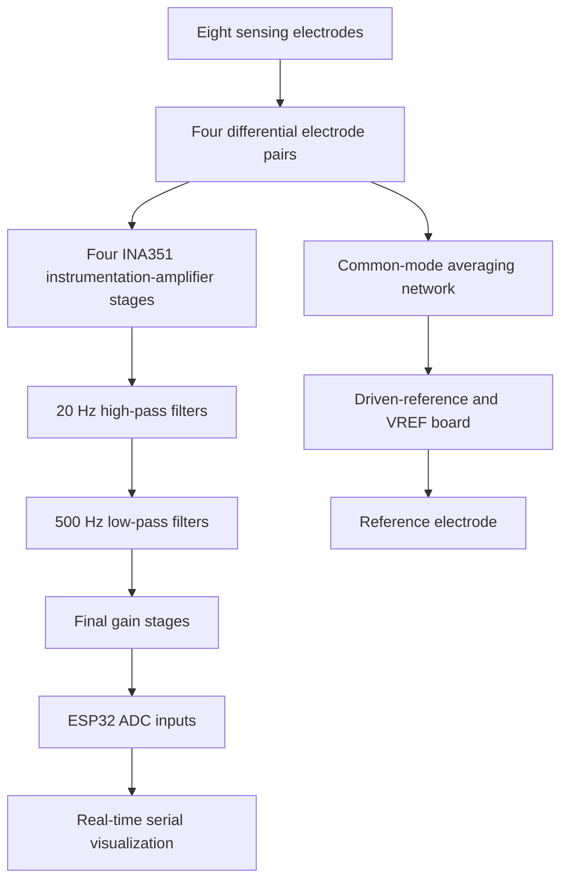

# Four-Channel EMG Wearable Forearm Brace

**Status:** Functional four-channel acquisition prototype; grip classification and prosthetic control remain in development

**Project period:** Summer 2026

> This is an experimental engineering prototype, not a medical device. It is not intended for diagnosis, treatment, or unsupervised clinical use.

## 1. Project Overview and Current Result

Surface electromyography, or sEMG, measures the electrical activity associated with muscle contraction using electrodes placed on the skin. Many of the muscles responsible for hand movement are located in the forearm, making multi-channel forearm EMG a potential input for grip classification and prosthetic hand control.

The objective of this project was to develop a low-cost wearable system capable of acquiring four forearm EMG channels simultaneously while reducing noise.

I designed and fabricated:

* Four compact analog front-end PCBs
* A separate driven-right-leg feedback and voltage-reference PCB
* A 3D-printed forearm brace that houses:
  *Mounting for eight sensing electrodes and one reference electrode
  *All the PCBs and an ESP32

The current prototype acquires and displays four simultaneous EMG channels with observable responses to finger movements. It establishes the hardware foundation for collecting labeled grip data, training a classification model, and eventually controlling a prosthetic hand in real time.

## 2. Demonstration


[Watch the full demonstration →](media/LiveDemo.MOV)

The demonstration shows the completed brace acquiring four EMG channels while different grips are performed.


## 3. System Architecture



Each EMG channel follows the same analog signal path:

1. Two electrodes measure the differential voltage across a region of the forearm.
2. An INA351 instrumentation amplifier provides an initial gain of 20.
3. A 20 Hz high-pass stage attenuates baseline drift and low-frequency artifacts.
4. A 500 Hz low-pass stage attenuates higher-frequency interference.
5. A final non-inverting stage increases the signal amplitude for acquisition.
6. The output is sampled by the ESP32 and displayed in real time.

A separate board generates a mid-supply voltage reference and implements a driven-right-leg circuit that feeds back to the reference electrode. A resistor network estimates the common-mode component across the electrodes, and the feedback circuit drives the reference electrode to reduce common-mode interference.

## 4. My Contributions

This was an independent project. I was responsible for the complete hardware and software workflow, including:

* Researching surface-EMG acquisition, electrode placement, analog filtering, and driven-reference circuits
* Defining the electrical and mechanical requirements
* Designing and simulating the analog front end in KiCad
* Modeling realistic electrode signals and interference
* Designing the individual EMG-channel PCBs
* Designing the driven-reference and voltage-reference PCB
* Preparing and reviewing PCB fabrication files
* Selecting and soldering the surface-mount components
* Designing the forearm brace in Onshape
* Printing and evaluating electrode-fit prototypes
* Mounting nine electrodes and the associated PCBs
* Wiring the complete wearable system
* Programming the ESP32 in C++ for four-channel acquisition and visualization
* Performing frequency-response and live wearable testing
* Documenting the development and debugging process

## 5. Design Requirements

| Requirement | Target | Current Status |
|---|---|---|
| Number of channels | Four simultaneous differential EMG channels | Demonstrated |
| Electrode count | Eight sensing electrodes and one reference electrode | Demonstrated |
| Target passband | Approximately 20–500 Hz | Simulated and bench-tested |
| Initial instrumentation gain | 20× per channel | Implemented |
| PCB size | Maximum of approximately 15 × 20 mm per channel board | Implemented |
| Electrode retention | Secure skin contact during hand movement | Implemented with fitted brace |
| Electrode opening | Fit the selected electrode hardware | Iterated to approximately 4.025 mm |
| Acquisition | Real-time four-channel display | Demonstrated |
| Wearability | Electronics mounted directly on the forearm | Functional prototype |
| Cost | Lower-cost alternative to commercial multi-channel EMG hardware | Final cost not yet calculated |
| Future compatibility | Produce data suitable for grip classification | Dataset and classifier not yet completed |


## 6. Major Design Decisions

### Four modular channel boards

I used four identical signal-conditioning PCBs rather than placing every channel on one large rigid board. This allowed the electronics to be distributed around the forearm, fit the brace geometry, and be tested or replaced one channel at a time.

### Differential instrumentation amplifier

Raw EMG signals are small and are easily overwhelmed by noise. The INA351 instrumentation amplifier was selected to amplify the signal due to its high common-mode rejection ratio.

### 20–500 Hz analog passband

The analog chain uses high-pass and low-pass filtering to retain the primary EMG frequency range while attenuating slow baseline drift, motion artifacts, and higher-frequency noise. Filtering before the ADC also reduces the amount of unwanted signal amplified by later stages.

### Driven-reference feedback

Power-line interference was a major concern because the body and electrode wires can couple environmental noise into every channel. I added a driven-reference circuit based on driven-right-leg topology to estimate the common-mode voltage and feed an inverted correction signal through the reference electrode.

The final board also generates the mid-supply voltage reference required for single-supply analog operation.

### Fixed electrode brace

Surface EMG is highly dependent on electrode position and skin contact. A wearable brace was used to keep the four electrode pairs in consistent locations while also carrying the circuitry.

### Electrode-fit coupon before the full brace

Instead of repeatedly printing the complete brace, I first created a small fitting test containing several electrode-hole diameters. This reduced print time and material use.

### 0805 surface-mount components

The PCBs needed to be small enough to fit the brace but practical enough to solder by hand. The selected component size balanced compactness with solderability.

### ESP32 acquisition

The ESP32 provided multiple ADC channels, C++ programmability, and a path toward future wireless telemetry and real-time prosthetic control.

The final repository should document the exact ESP32 variant, ADC pins, attenuation configuration, sampling rate, and any input scaling or protection used.

## 7. Challenges, Failed Approaches, and Fixes

### Driven-reference implementation

**Problem:** I needed to incorporate driven-reference feedback into a four-channel system rather than treating each channel as an isolated circuit.

**Fix:** I designed a separate board that generated VREF and used a resistive averaging network connected to the sensing inputs to estimate the system’s common-mode voltage.

**Result:** The driven-reference circuit could be shared across all four sensing channels and connected to a single reference electrode.

### Electrode-hole sizing

**Problem:** The dimensions taken from the electrode hardware did not directly produce the desired printed fit.

**First approach:** I printed a fitting test with nominal openings of 3.575, 3.650, 3.725, 3.800, 3.875, 3.950, 4.025, and 4.100 mm.

**Fix:** Based on the physical test, I revised the opening to 4.025 mm.

**Result:** The revised geometry produced more secure and repeatable electrode retention in the completed brace.

### PCB area constraint

**Problem:** Each sensing board had to fit within an approximately 15 × 20 mm region of the brace.

**Fix:** I distributed the system across four identical channel boards and a separate driven-reference/VREF board. Component selection occurred after the mechanical envelope had been established.

**Result:** The fabricated electronics could be mounted directly on the wearable structure.

### Fabricated-board debugging

**Problem:** Debugging the complete output alone did not reveal which analog stage was responsible for an unexpected response.

**Fix:** I injected known signals with a function generator and recorded the outputs of the instrumentation-amplifier, filter, and final-gain stages separately. I tested the output at frequencies ranging from 1 Hz to 1 kHz.

**Result:** The node-by-node procedure made it possible to evaluate each stage independently and reveal a burnt chip from the low-pass filter stage.

## 8. Testing and Measurable Results

### Simulation testing

The analog front end was evaluated using:

* AC frequency sweeps
* Transient simulations
* Millivolt-scale differential inputs
* Simulated electrode impedances
* Driven-reference feedback
* A mid-supply voltage reference
* SPICE models for the respective IC’s involved

The simulation demonstrated:

* A stable baseline around the mid-supply reference
* Amplification of the differential input
* Attenuation below the 20 Hz high-pass region
* Attenuation above the 500 Hz low-pass region
* An initial instrumentation-amplifier gain of 20


### Bench testing

The fabricated signal board was driven with known test signals at:

`1, 5, 10, 20, 30, 50, 100, 200, 300, 400, 500, 600, 800, and 1000 Hz`

Outputs were captured at the instrumentation-amplifier and final-output nodes. This provided evidence that the fabricated board responded across the intended EMG band and attenuated signals outside it.

### Mechanical testing

| Measurement                |                 Result |
| -------------------------- | ---------------------: |
| Sensing channels           |                      4 |
| Sensing electrodes         |                      8 |
| Reference electrodes       |                      1 |
| Total electrodes           |                      9 |
| Target PCB envelope        | 15 × 20 mm per channel |
| Selected electrode opening | Approximately 4.025 mm |

### Wearable demonstration

The completed system displayed four channels simultaneously while finger and hand movements were performed. Each channel showed observable changes during muscle activation.

The current demonstration establishes functional acquisition, but it does not yet provide formal measurements of:

* Signal-to-noise ratio
* Common-mode rejection improvement with and without driven feedback
* Channel crosstalk
* Session-to-session repeatability
* Electrode-placement sensitivity
* ADC accuracy or effective resolution
* Sampling latency
* Grip-classification accuracy

These measurements are planned for the next development phase.

## 9. Repository Guide

```text
emg-forearm-brace/
├── README.md
├── firmware/
│   └── esp32-emg-acquisition/
│       ├── src/
│       └── README.md
├── cad/
│   ├── source/
│   │   └── onshape-link.md
│   └── stl/
│       ├── fitting-test.stl
│       ├── forearm-brace.stl
│       └── wire-pin.stl
├── electronics/
│   ├── emg-channel/
│   │   ├── kicad/
│   │   ├── gerbers/
│   │   └── emg-channel-schematic.pdf
│   ├── drl-vref/
│   │   ├── kicad/
│   │   ├── gerbers/
│   │   └── drl-vref-schematic.pdf
│   └── parts-list.md
├── docs/
│   ├── development-log.md
│   ├── design-requirements.md
│   ├── simulation/
│   └── testing/
├── media/
│   ├── live-demo.mp4
│   ├── live-demo.webp
│   └── brace-and-pcbs.jpg
└── references.md
```

### Directory descriptions

* `firmware/` contains the ESP32 acquisition and serial-output code.
* `cad/` contains the printable brace components
* `electronics/` contains KiCad sources, schematics, PCB layouts, and the parts list.
* `docs/simulation/` contains the Bode plots and transient-analysis results.
* `docs/testing/` contains the injected-frequency captures and debugging evidence.
* `media/` contains compressed demonstration media used by the README.
* `references.md` cites the EMG papers and technical resources used during development.

Research papers should be linked or cited rather than redistributed unless their licenses permit redistribution.

## 10. How to Reproduce or Run It

### Safety warning

This is body-connected experimental electronics. Clinical biopotential systems use power and data isolation to limit leakage and ground-loop currents. This prototype has not been evaluated against medical electrical-safety standards.

When electrodes are attached:

* Use an isolated battery power source.
* Do not connect the system to mains-powered bench equipment.
* Disconnect the electrodes before charging, soldering, or probing the circuit.
* Prefer wireless telemetry over a wired connection to a mains-powered computer.
* Do not use the device for diagnosis, treatment, or testing on other people without qualified supervision.

For background on isolation in patient-connected electronics, see Texas Instruments’ [patient-monitor isolation guidance](https://www.ti.com/lit/an/sloa285a/sloa285a.pdf).

### Required hardware

* Four assembled EMG-channel PCBs
* One assembled driven-reference/VREF PCB
* ESP32 development board: **[ADD EXACT MODEL]**
* Eight 3M Red Dot 2560 sensing electrodes
* One reference electrode
* Printed forearm-brace components
* Battery power source: **[ADD EXACT BATTERY/SUPPLY]**
* Wiring, connectors, and mounting hardware

### Build procedure

1. Fabricate four copies of the EMG-channel board using the Gerber package in `electronics/emg-channel/gerbers/`.
2. Fabricate one driven-reference/VREF board using the Gerbers in `electronics/drl-vref/gerbers/`.
3. Assemble the PCBs according to the schematics and parts list.
4. Verify power, ground, and VREF before connecting electrodes or the ESP32.
5. Inject a small known test signal and confirm the output of every analog stage.
6. Print the brace and electrode-retention components from `cad/stl/`.
7. Install four differential electrode pairs and the reference electrode.
8. Mount the four channel boards and the driven-reference board on the brace.
9. Connect the channel outputs to the selected ESP32 ADC pins.
10. Confirm that every analog output remains within the safe ADC input range for the exact ESP32 model. Add attenuation, clamping, or an external ADC if required.
11. Flash the firmware in `firmware/esp32-emg-acquisition/`.
12. Configure the documented ADC attenuation and sampling rate.
13. Open the specified serial plotting application at **[ADD BAUD RATE]**.
14. Establish a resting baseline before performing hand or finger movements.

The ESP32’s usable ADC range depends on its specific variant and attenuation configuration. Document the final voltage-scaling circuit and verify it against the appropriate [Espressif ADC documentation](https://docs.espressif.com/projects/esp-idf/en/v4.4.7/esp32/api-reference/peripherals/adc.html).

## 11. Current Limitations and Next Steps

Development is currently paused during my transition to UT Austin. I plan to resume the project using university maker-space resources and, if possible, research mentorship.

### Current limitations

* No labeled multi-grip dataset has been collected.
* No classification model has been trained or evaluated.
* Signal-to-noise ratio and common-mode rejection have not been quantified.
* The effect of electrode-position variation has not been measured.
* Testing has primarily been performed on a single user.
* The exposed wiring and separate boards are not yet packaged for long-term wearable use.
* The ESP32 sampling rate, ADC configuration, and voltage scaling need to be formally documented.
* The system has not been evaluated for medical safety or clinical use.
* Total system cost has not yet been calculated.
* Long-session comfort and electrode contact stability have not been evaluated.

### Next steps

1. Finalize the ESP32 acquisition code and document the sampling configuration.
2. Verify ADC input scaling and add protection or an external ADC if necessary.
3. Quantify the noise floor, signal-to-noise ratio, common-mode rejection, and channel crosstalk.
4. Design a repeatable electrode-placement and calibration procedure.
5. Record labeled data for several hand grips across multiple sessions.
6. Establish simple classification baselines before comparing them with a neural network.
7. Evaluate classification accuracy, confusion between grips, and real-time latency.
8. Integrate the classifier with a motorized prosthetic hand.
9. Replace temporary wiring with a more robust harness or consolidated PCB revision.
10. Add battery power and wireless telemetry for safer, less restrictive wearable testing.
11. Evaluate the system across additional users only under appropriate supervision and safety controls.
12. Compare the total cost and performance with existing commercial EMG systems.


